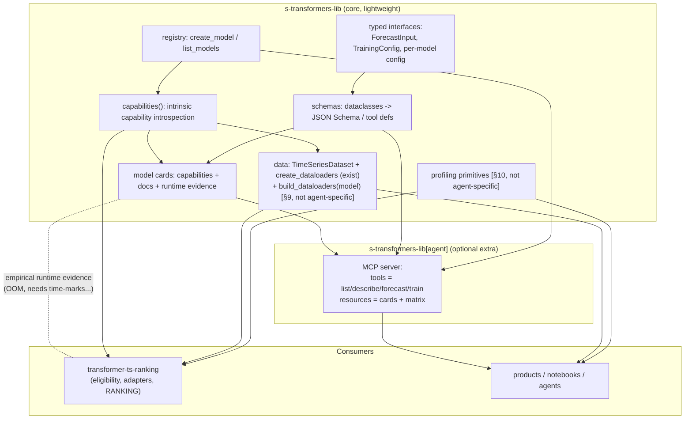

# Design Document — Integration Layer for `s-transformers-lib` (Agentic & Programmatic Consumption)

| | |
|---|---|
| **Status** | Draft / RFC — for review in the `s-transformers-lib` repository |
| **Author** | J. Javier A. R. |
| **Date** | 2026-09-03 |
| **Target repo** | `s-transformers-lib` (the library), **not** `transformer-ts-ranking` (this benchmark) |
| **Related** | `transformer-ts-ranking` discovery layer, `configs/benchmark/model_capability_matrix.yaml`, `docs/model_notes.md` |

> This document is produced *from* the benchmark repository as a deliverable, but the
> work it describes belongs in the library. Nothing here is implemented in
> `s-transformers-lib` yet. The benchmark repo must never modify the submodule; this is a
> spec to carry over, not a change to apply here.
>
> **Scope note.** The headline goal is making the library *agent-consumable* (Components 1–5,
> §4–§8), but several of these foundations are just as valuable to **any** programmatic consumer —
> the benchmark included. Components 6–7 (§9–§10, model-aware data loading and profiling
> primitives) are **not agent-specific**; they live here because they share the same library/benchmark
> split, the same parity safeguard, and the same "declare once, stop duplicating" principle. Keeping
> them in one document avoids re-stating that shared framing in a second file.

---

## 1. Motivation

`s-transformers-lib` already exposes a clean, unified programmatic API — `create_model(name, config)`,
`list_models()`, a registry, `BaseTransformerModel`, and typed `ForecastInput` / `TrainingConfig`.
That makes it usable by a *human* who reads the code. It does **not** make it usable by an
**autonomous agent**, which needs four things the library does not yet provide:

1. **Discoverability** — a machine-readable list of what models exist and what each *is for*.
2. **Invocable contracts** — typed input/output **schemas** (JSON Schema / tool definitions) an
   LLM can fill in with function-calling, not just Python signatures.
3. **Selection guidance** — *which* model to pick given a task ("regular multivariate series with
   exogenous features, horizon 96"), in a form the agent can reason over.
4. **Structured failure semantics** — known runtime constraints (memory, required time marks) as
   data, not prose, so an agent can avoid or recover from them.

The benchmark repository (`transformer-ts-ranking`) currently *re-derives* much of #1 and #4 by
introspecting the library (its `discovery/` layer builds a capability matrix and an API-contract
report). That duplication is the signal that this knowledge belongs **in the library**: the
library is the single source of truth about its own models, and every consumer — this benchmark, a
notebook, a product, an agent — should inherit the agent interface rather than rebuild it.

### Goals

- Make every registered model **discoverable, describable, and invocable** by an agent.
- Keep the **core library lightweight** — no agent-framework dependency forced on users who only
  train models.
- Provide a **standard, transport-agnostic** contract (JSON Schema) plus an **optional MCP** server.
- Establish **model cards** as the durable, human- and machine-readable description of each model,
  fed by empirical runtime evidence.

### Non-goals

- No changes to model math or the `fit`/`predict` semantics.
- No benchmark/ranking logic (that stays in `transformer-ts-ranking`).
- No agent *orchestration* (planning, memory) — this layer only makes the library a good **tool**.

---

## 2. Design principles

1. **Single source of truth.** Capabilities and contracts are declared once, next to the models,
   and derived — never hand-maintained in two places.
2. **Core is dependency-light.** Introspection + schema generation live in the core package with
   only stdlib + existing deps. The MCP server is an **optional extra** (`s-transformers-lib[agent]`).
3. **Derive, don't duplicate.** Schemas come from the existing typed dataclasses
   (`ForecastInput`, `TrainingConfig`, per-model `config.py`). Model cards compose declared
   capabilities + empirical evidence.
4. **Backwards compatible.** Everything is additive; the current API keeps working untouched.
5. **Consumer concerns stay out.** Benchmark eligibility, adapters, and ranking are *not* library
   concerns and are not moved in.

---

## 3. Architecture overview



Five agent-facing components, in dependency order: **capabilities → schemas → model cards →
(optional) MCP → selection guidance** (§4–§8). Plus two **non-agent-specific** foundations that
reuse the same capability layer and serve every consumer: **model-aware data loading** (§9) and
**profiling primitives** (§10).

---

## 4. Component 1 — Capability introspection (moves from the benchmark)

Add a first-class capability descriptor to the library, so a model *declares* what it needs
instead of a consumer *guessing* by introspection.

**Where declared:** each model's `config.py` (or a class attribute on the model) declares a
`ModelCapabilities` dataclass. The registry aggregates them.

```python
# s_transformers_lib/interfaces/capabilities.py
@dataclass(frozen=True)
class ModelCapabilities:
    supports_regular_mts: bool
    supports_univariate: bool
    requires_time_marks: bool          # needs x_mark / y_mark
    requires_exogenous: bool
    requires_irregular_times: bool     # needs x_time / x_mask / pred_time (e.g. tpatchgnn)
    requires_spatial_structure: bool
    is_pretrained_zeroshot: bool
    family: str                        # "encoder_only" | "seq2seq" | ...
```

**Public API additions (backwards compatible):**

```python
list_models() -> list[str]                    # already exists
capabilities(name: str) -> ModelCapabilities  # NEW
describe_model(name: str) -> ModelCard         # NEW (see §6)
```

These are the *intrinsic* capability fields the benchmark currently keeps in
`model_capability_matrix.yaml`. They are model-intrinsic and move to the library. The
benchmark-specific fields (`eligible_long_term`, `eligible_m4`, `adapter_name`,
`review_status`) **stay in the benchmark** — they are consumer decisions (see §11).

---

## 5. Component 2 — Schema generation (contracts an LLM can fill)

The library already has the typed objects an agent must construct: `ForecastInput`,
`TrainingConfig`, and each model's `config`. Generate **JSON Schema** from them so a
function-calling agent can produce valid arguments, and validate what it receives.

- **Input schema** for `forecast`: derived from `ForecastInput`
  (`x`, `x_mark`, `y_full`, `y_mark`; the irregular fields `x_time`/`x_mask`/`pred_time`
  appear only when `requires_irregular_times`). Tensor fields expressed as shape/dtype specs:
  `x: {shape: [batch, seq_len, n_channels], dtype: float32}`.
- **Config schema** for `create_model`: derived per model from its `config.py` dataclass
  (fields, types, defaults, ranges where known).
- **Output schema** for the forecast result: `prediction: {shape: [batch, pred_len, channels]}`.

Implementation: a small `schemas.py` that walks dataclass fields / type hints
(`dataclasses.fields`, `typing.get_type_hints`) and emits Draft-2020-12 JSON Schema. No heavy
dependency; optionally `pydantic` if the library already uses it.

**Tool definitions** (the function-calling contract) are then a thin wrapper — see §7.

---

## 6. Component 3 — Model cards (the durable description)

A **model card** per model is the single artifact that both a human and an agent read. It composes
three sources:

1. **Declared** — `ModelCapabilities` (§4) + the config schema (§5).
2. **Documented** — the paper reference, a one-line "what it's good at", family, a natural-language
   *selection hint*.
3. **Empirical (runtime evidence)** — memory profile, known failure modes, node/precision
   constraints. **This is fed by the benchmark** (see §12).

Proposed format (`model_cards/<name>.yaml`, or generated on the fly by `describe_model`):

```yaml
name: patchtst
family: encoder_only
paper: "A Time Series is Worth 64 Words (Nie et al., 2023)"
summary: "Patch-based channel-independent transformer; strong general long-term baseline."
capabilities:
  supports_regular_mts: true
  requires_time_marks: false
  requires_irregular_times: false
selection_hints:
  good_for: ["long-horizon multivariate", "channel-independent series"]
  avoid_when: ["irregular sampling", "very short series"]
config_schema: { $ref: "schemas/patchtst.config.json" }
forecast_schema: { $ref: "schemas/forecast_input.json" }
runtime:                       # provenance: empirical, source = transformer-ts-ranking
  precision: fp32
  default_config_note: "Library default d_model=768/d_ff=3072 is large; benchmark uses 256/512."
  known_issues: []
```

Cards carry a **provenance** marker on empirical fields (`source: transformer-ts-ranking@<commit>`)
so declared vs measured is auditable.

---

## 7. Component 4 — MCP server (optional extra)

Model Context Protocol is the transport-agnostic standard for exposing tools, resources, and
prompts to agents. Ship it as an **optional extra** so the core stays light.

**Resources** (read-only data the agent browses):

| URI | Content |
|---|---|
| `stlib://models` | list of models + one-line summaries |
| `stlib://models/{name}` | the full model card (§6) |
| `stlib://capabilities` | the capability matrix (intrinsic fields) |

**Tools** (functions the agent calls):

| Tool | Args | Returns |
|---|---|---|
| `list_models` | `filter?` (capability predicate) | names + summaries |
| `describe_model` | `name` | model card |
| `recommend_models` | task descriptor (horizon, multivariate?, exogenous?, irregular?) | ranked candidate list + why |
| `forecast` | `name`, `config?`, `ForecastInput` (schema-validated) | `prediction` tensor spec + values |
| `train` *(guarded)* | `name`, `config`, data handle, `TrainingConfig` | run handle / metrics |

`forecast`/`train` reuse `create_model` and the existing `fit`/`predict` — no reimplementation.
Long-running `train` should be async/handle-based, never a blocking tool call.

Entry point: `python -m s_transformers_lib.agent.mcp` (installed via `pip install
s-transformers-lib[agent]`).

---

## 8. Component 5 — Selection guidance

"Which model?" is the highest-value thing an agent needs. Two complementary forms:

- **Machine-readable:** the `recommend_models` tool filters by capabilities and ranks by the
  `selection_hints` + (optionally) published benchmark ranks.
- **Optional Agent Skill:** a packaged `forecasting-toolkit` skill (natural-language playbook:
  "for long-term multivariate start with patchtst/itransformer; for irregular sampling use
  tpatchgnn; …") for agent runtimes that support skills. This is documentation, not code, and can
  cite the benchmark leaderboard.

---

## 9. Component 6 — Model-aware data loading *(not agent-specific)*

The library **already** ships strong data plumbing — `TimeSeriesDataset`, `create_dataloaders(...)`
(temporal split **before** windowing, so no leakage), plus `scalers`, `revin`, `time_features`,
`masking`, `imputation`. Accuracy metrics also already exist (`mse/mae/rmse/mape/smape/mase/r2_score`,
`compute_all_metrics`). **Do not reimplement these** — reuse them (the benchmark currently duplicates
part of this in its own windowing/metrics, another de-duplication opportunity).

What is **missing** is the last mile: `create_dataloaders` takes a `mode`/`label_len`, but the
*caller* must know which mode and which mark tensors each model needs. Add a **model-aware
resolver** that reads the declared capabilities (§4) and returns correctly-shaped loaders:

```python
# s_transformers_lib/data/loaders.py
def build_dataloaders(model_name: str, data, *, seq_len, pred_len, **kw
) -> tuple[DataLoader, DataLoader, DataLoader]:
    """create_dataloaders configured from the model's ModelCapabilities:
    resolves mode/label_len from `family`, and injects zero x_mark/y_mark
    when `requires_time_marks` (the intrinsic half of the benchmark's adapters)."""
```

This is exactly the **intrinsic** part of what the benchmark's `adapters/` do (mark injection for the
seq2seq models, mode/label_len selection). Moving that intrinsic resolution into the library means an
agent — or any user — can say "give me loaders for `patchtst` on this data" and get the right batch
format without knowing each model's quirks. The **consumer-specific** part of the adapters (the
benchmark's exact batch dictionary, hardware batch overrides) stays in the benchmark (§11).

---

## 10. Component 7 — Efficiency profiling primitives *(not agent-specific)*

The library has **no** general efficiency measurement (only incidental timing inside two pretrained
models). Add small, unopinionated primitives — nothing benchmark-flavored:

```python
# s_transformers_lib/profiling.py
def count_parameters(model) -> int: ...
@contextmanager
def profile_run(device):            # yields a handle exposing wall_time_s and peak_gpu_mb
    ...
def inference_latency(model, sample, n=50) -> float:   # ms/sample
    ...
```

**Boundary (important).** The library provides the *primitives*; the **methodology stays in the
benchmark** — the composite "efficiency score", the per-epoch JSONL, the leaderboards, and OWA (which
needs the Naive2 reference) are *comparison decisions*, not model capabilities. This mirrors the same
split as capabilities vs eligibility: reusable brick in the library, scoring policy in the consumer.

---

## 11. What stays in `transformer-ts-ranking`

The split is: **intrinsic capability → library; consumer decision → benchmark.**

| Stays in the benchmark | Reason |
|---|---|
| `eligible_long_term`, `eligible_m4` | Track-specific eligibility is a benchmark decision |
| `adapters/` — **only** the consumer-specific batch dict | The *intrinsic* half (mark injection, mode/label_len) moves to the library's `build_dataloaders` (§9) |
| Ranking: Friedman / Nemenyi / CD, leaderboards | The benchmark's whole purpose |
| Efficiency **methodology**: composite score, per-epoch JSONL, OWA (Naive2) | Comparison policy, not a model capability — uses the library's profiling primitives (§10) |
| Per-model batch/context overrides for *this* hardware | Deployment-specific, not intrinsic |

After the move, the benchmark **consumes** from the library instead of re-implementing:
`capabilities()` (not re-introspection), `build_dataloaders` (not its own windowing), the accuracy
metrics, and the profiling primitives — keeping only its eligibility overlay, adapter batch dict,
scoring policy, and ranking.

---

## 12. The benchmark as validator and feeder

There is a clean, virtuous data flow:

```
library declares capabilities  ->  benchmark runs every model  ->  benchmark measures runtime truth
        ^                                                                     |
        |________________ empirical evidence feeds model-card `runtime` ______|
```

The benchmark has already produced exactly the empirical evidence model cards need, e.g.:

- `contiformer` — ODE solver OOMs at every batch size even on A100; needs context ≤ 48.
- `pathformer` — FFT encoder OOMs on high-channel datasets (electricity/traffic).
- 8 seq2seq models crash without injected zero time-marks.
- Group B models require `x_mark_enc`/`x_mark_dec`/`x_dec` at `predict`.
- Default configs for `fedformer`/`patchtst` are oversized.

Mechanism: the benchmark exports a `runtime_evidence.json` (per model: precision, memory profile,
known issues, provenance commit); the library's card generator merges it into the `runtime:`
section. Declared capabilities and measured behavior stay distinguishable by provenance.

---

## 13. Packaging

```
s-transformers-lib/
  src/interfaces/capabilities.py     # ModelCapabilities (core)
  src/schemas.py                     # dataclass -> JSON Schema (core, light)
  src/model_cards/                   # <name>.yaml + generated schemas (core, data)
  src/data/loaders.py                # build_dataloaders(model_name, ...) (core)  [§9]
  src/profiling.py                   # count_parameters / profile_run / latency (core)  [§10]
  src/agent/mcp.py                   # MCP server (extra: [agent])
pyproject: optional-dependencies.agent = ["mcp", ...]
```

Core adds **zero heavy dependencies**. `[agent]` pulls the MCP SDK only for those who want it.

---

## 14. Phasing

| Phase | Deliverable | Depends on |
|---|---|---|
| **P1** | `ModelCapabilities` + `capabilities()` in the library; benchmark switches to consume it | — |
| **P2** | `schemas.py` — JSON Schema from `ForecastInput`/`TrainingConfig`/per-model config | P1 |
| **P3** | Model cards (declared + documented) + `describe_model()` | P1, P2 |
| **P4** | Benchmark exports `runtime_evidence.json`; cards gain the `runtime:` section | P3 + a full benchmark run |
| **P5** | MCP server as `[agent]` extra (`list/describe/recommend/forecast`) | P2, P3 |
| **P6** | `forecasting-toolkit` Agent Skill + selection playbook citing the leaderboard | P3, P5 |
| **P7** | `build_dataloaders(model_name, ...)` — model-aware loader resolution (§9) | P1 |
| **P8** | Profiling primitives `count_parameters` / `profile_run` / `inference_latency` (§10) | — |

P1–P3 are pure library refactors with immediate payoff (the benchmark stops duplicating). P4
closes the loop with this repo. P5–P6 are the agent-facing surface. **P7–P8 are independent of the
agent surface** — non-agent utilities that consolidate data/efficiency plumbing; P8 has no
dependencies and can land any time; P7 depends on P1 (it reads declared capabilities).

### ⚠️ P1 safeguards (mandatory — protect benchmark validity)

Moving capability declaration into the library is the **only** step that can perturb the
benchmark, because the benchmark's *eligible model set* is derived from those capabilities. Two
hard constraints:

1. **Capability-preserving (parity gate).** After P1, regenerate the eligibility overlay and
   assert the resulting eligible-model set is **identical** to the pre-P1 set (diff the generated
   `model_capability_matrix.yaml` — intrinsic fields must match what introspection produced today).
   Any change to the eligible set is a **methodological change** to the ranking population and must
   be reviewed and justified explicitly, never applied silently.
2. **Never mid-run.** Do **not** land P1 while a benchmark run is in flight. A shift in eligibility
   mid-run would mean different shards ran against different model sets. Land P1 only when no
   benchmark job is queued or running, then re-verify parity before the next run.

Everything else (P2–P6, P8) is additive and cannot change benchmark results: the experimental path
(`create_model → fit → predict`), metrics, seeds, precision, and ranking are untouched, and
already-persisted results remain valid.

**P7 caveat (only if the benchmark later adopts `build_dataloaders`).** Shipping the loader in the
library changes nothing on its own. But if the benchmark *migrates* onto it, that migration must be
**batch-preserving**: the loaders must yield windows, splits, scaling, and injected marks **identical**
to the current `window_dataset.py` + adapters, verified by a byte-level batch diff on a fixed seed
before any results are regenerated. Same discipline as the P1 parity gate, and likewise never
mid-run. Until such a migration is deliberately validated, the benchmark keeps its own data path and
only *new* consumers use `build_dataloaders`.

---

## 15. Open questions / risks

- **`train` as a tool** is dangerous (long, resource-heavy). Recommend: expose only as an async,
  explicitly-guarded tool, or omit from the default MCP surface and keep `forecast` (inference)
  as the primary agent capability.
- **Config schema completeness** — some per-model configs may lack ranges/enums; start with
  types+defaults and enrich over time.
- **Card staleness** — empirical `runtime` fields are only as current as the last benchmark run;
  the provenance commit makes staleness visible.
- **MCP SDK churn** — pin the SDK in the `[agent]` extra; the core contract (schemas, cards) is
  SDK-independent, so churn is contained to one optional module.
- **Benchmark perturbation via P1** *(highest-priority operational risk)* — the capability move can
  silently change the eligible model set and thus the ranking population. Mitigated by the two
  mandatory P1 safeguards above (parity gate + never mid-run). Treat any eligible-set diff as a
  methodological change requiring explicit review.

---

## 16. Appendix — concrete sketches

**`recommend_models` request/response**

```json
// request
{ "horizon": 96, "multivariate": true, "exogenous": false, "irregular": false }
// response
[ { "name": "patchtst", "why": "regular multivariate, strong long-term baseline" },
  { "name": "itransformer", "why": "inverted attention, top benchmark rank on multivariate" } ]
```

**`forecast` input (schema-validated)**

```json
{ "name": "patchtst",
  "config": { "d_model": 256, "n_heads": 8, "d_ff": 512 },
  "input": { "x": {"shape": [1, 96, 7], "dtype": "float32"},
             "x_mark": {"shape": [1, 96, 4], "dtype": "float32"} } }
```

**Capability filter for `list_models`**

```python
list_models(filter=lambda c: c.supports_regular_mts and not c.requires_irregular_times)
```
